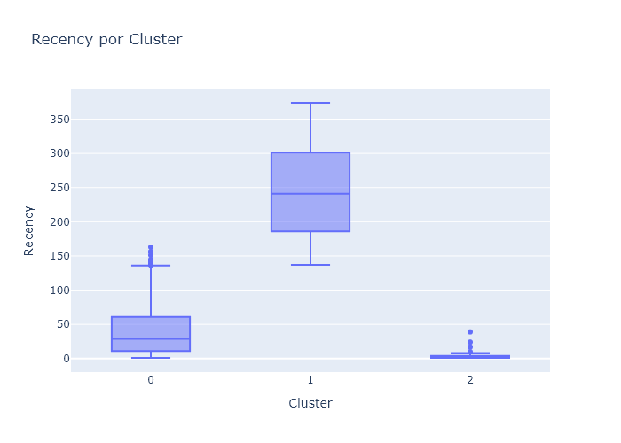
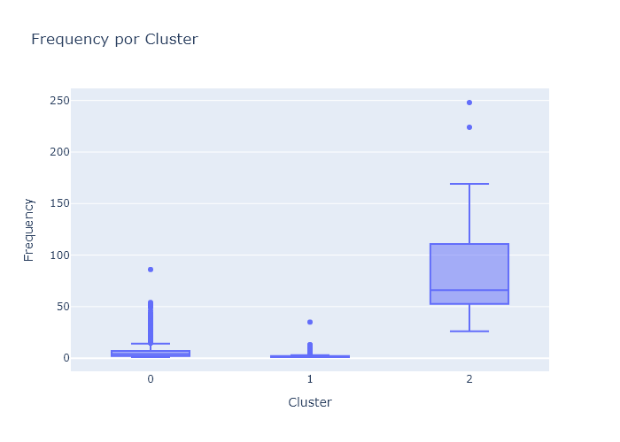
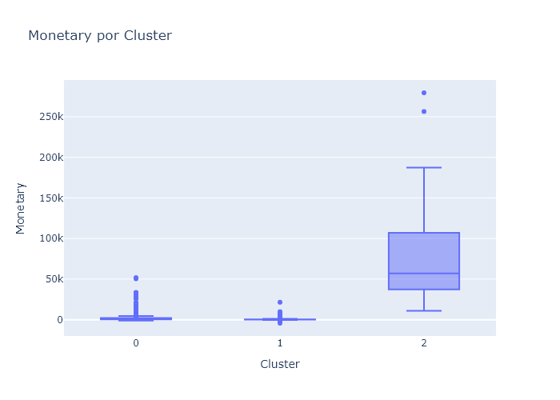
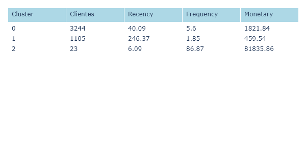

# Segmentando Clientes com Clusterização: Estratégias de Marketing para Varejo

### 🧠 Objetivo do Projeto

Este projeto tem como objetivo segmentar clientes com base em seu comportamento de compra, utilizando técnicas de **clusterização não supervisionada** . O objetivo final é criar grupos distintos de clientes que ajudem a empresa a **direcionar campanhas de marketing mais eficazes** , identificar perfis de alto valor e estratégias de retenção.

---

### ⚙️Criando env

```
conda create --name cases_data_science python=3.10
conda activate cases_data_science
```

Se precisar deletar env

```
conda remove --name cases_data_science --all
```

Exportar notebook para md

```
jupyter nbconvert notebook.ipynb --to markdown --no-input

```

---

### 📊 Fonte e Explicação dos Dados

- **Fonte** : Dataset público de e-commerce do Reino Unido (UK Online Retail Data).
- **Link direto (Kaggle)** : [https://www.kaggle.com/datasets/carrie1/ecommerce-data]()
- **Descrição** : Dados de transações feitas por uma empresa de e-commerce online com sede no Reino Unido, durante o período de 01/12/2010 a 09/12/2011. As colunas incluem:
- InvoiceNo, StockCode, Description, Quantity, InvoiceDate, UnitPrice, CustomerID, Country

O dataset é ideal para análise de comportamento do cliente e criação de perfis.

---

### 🗂️ Estrutura de Pastas e Arquivos

```
customer-segmentation-clustering-retail/
│
├── data/
│   ├── raw/                 # Dados brutos
│   └── processed/           # Dados tratados para análise
│
├── notebooks/
│   ├── 01_eda.ipynb         # Análise exploratória dos dados
│   ├── 02_rfm_clustering.ipynb  # Aplicação de clusterização com K-Means
│   ├── 03_visualizations.ipynb  # Visualização dos clusters e insights
│
├── reports/
│   └── figures/             # Gráficos e imagens geradas
│
├── requirements.txt         # Dependências do projeto
├── README.md

```

---

### 🔁 Etapas do Processo

1. **Coleta de Dados**

   Download manual ou automático do dataset via link do Kaggle.

2. **Tratamento de Dados**

   - Limpeza de duplicatas e valores ausentes
   - Conversão de tipos de dados
   - Criação das métricas RFM (Recência, Frequência e Valor Monetário)

3. **Análise Exploratória (EDA)**

   - Distribuições, correlações, comportamento por país e sazonalidade
   - Detecção de outliers

4. **Modelagem com K-Means**

   - Aplicação do algoritmo de clusterização K-Means
   - Determinação do número ideal de clusters (método do cotovelo)

5. **Visualização e Interpretação**

   - Gráficos de dispersão por cluster
   - Análise e descrição dos perfis identificados
   - Recomendações de ação para o negócio

---

### ⚙️ Como Executar Localmente

1. Clone o repositório:

```
git clone https://github.com/seuusuario/customer-segmentation-clustering-retail.git
cd customer-segmentation-clustering-retail
```

2. Crie um ambiente virtual (opcional) e instale as dependências:

```
pip install -r requirements.txt
```

3. Inicie os notebooks:
   ```
   jupyter notebook
   ```

Abra os notebooks na pasta `notebooks/` e execute em ordem:

`01_eda.ipynb` → `02_rfm_clustering.ipynb` → `03_visualizations.ipynb`

### 📊 Salvar gráficos

Plotly precisa da biblioteca **kaleido** para exportar gráficos como imagem:

```
pip install -U kaleido
```

---

## ✅ Resultados

Exploramos visualmente os resultados do modelo de clustering aplicado aos clientes, com base nas métricas RFM:

- **Recency** : Tempo desde a última compra.
- **Frequency** : Número de compras no período analisado.
- **Monetary** : Valor total gasto.

### 🎨 Visualização com Boxplots

Foram gerados boxplots para analisar a distribuição das variáveis RFM por cluster. Isso permitiu identificar rapidamente as diferenças entre os segmentos em termos de comportamento de compra.

🔍 Veja a versão interativa com gráficos dinâmicos no [notebook.](notebooks/03_visualizations_interactive.ipynb)

### 📊 Boxplots por Cluster





### 🧠 Interpretação Estatística

Também foi realizada uma análise descritiva com a média de cada métrica por cluster e a contagem de clientes em cada grupo.



### 🧾 Insights

Com base nas métricas de Recência, Frequência e Valor Monetário (RFM), os clusters obtidos revelam perfis de clientes bem distintos:

##### 🔹 **Cluster 0 — Clientes Ativos e Importantes**

- **Clientes:** 3.244 (maior grupo)
- **Recency:** 40 dias (clientes recentes)
- **Frequency:** ~5,6 compras
- **Monetary:** R$ 1.821,84 em média

Esses são **clientes ativos** , com compras relativamente recentes e frequência boa. Representam um público relevante para estratégias de fidelização e up-sell.

---

##### 🔸 **Cluster 1 — Clientes Inativos ou de Baixo Valor**

- **Clientes:** 1.105
- **Recency:** 246 dias (clientes inativos ou distantes)
- **Frequency:** ~1,8 compras
- **Monetary:** R$ 459,54 em média

Este grupo representa **clientes que compraram há muito tempo e gastaram pouco** . Podem ser alvo de campanhas de reativação, promoções específicas ou comunicações personalizadas para reconquistar.

---

##### ⭐ **Cluster 2 — Clientes VIPs**

- **Clientes:** 23 (grupo mais seleto)
- **Recency:** apenas 6 dias (super recentes)
- **Frequency:** ~87 compras!
- **Monetary:** R$ 81.835,86 em média 😮

São os **clientes mais valiosos** : compram com muita frequência, gastam muito e fizeram compras muito recentemente. Merecem atenção especial com programas de recompensa, atendimento premium e ofertas exclusivas.

---

## 🎯 Resumo Estratégico

- O **Cluster 2** , embora pequeno, concentra **clientes de altíssimo valor** — são prioridade máxima para retenção e satisfação.
- O **Cluster 0** é o **maior e mais engajado** , com bom potencial de receita contínua.
- Já o **Cluster 1** é o grupo com **maior risco de abandono** e menor valor — ideal para testar estratégias de reengajamento.
